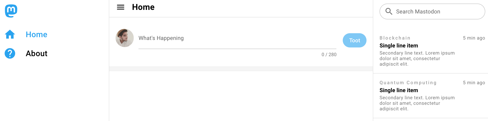

# A Twitter UI like Mastodon client. I'm not a big fan of Mastodon's UI 



# Vue App (mastodon-client)

VueJS App

## Install the dependencies
```bash
npm install
```

### Web App 
```bash
quasar dev 
```

### Electron Mac/Windows/Linux App 
```bash
quasar dev -m electron
```

### Lint the files
```bash
npm run lint
```

### Build the app for production
```bash
quasar build
```

### You can also build Browser Extension (BEX) with Quasar and this entire app can serve as homepage/configuration page like sponsorblock or grammarly

```bash
quasar dev -m bex
```

You can inject the Vue App in web page using Iframe 

You can do that in `src-bex/content-hooks.js` with 

seding any event using `$q` object from `App.vue`

For example. 
```javascript
this.$q.bex.send('MY_CUSTOM_EVENT')
```


```javascript
export default function attachContentHooks (bridge) {
  // handle event
  bridge.on('MY_CUSTOM_EVENT', function (event) {
    document.getElementsByTagName('body')[0].remove()
  })
}

// create iframe
function createIframe () {
  const iframe = document.createElement('iframe')
  iframe.width = '120px'
  iframe.height = '50px'

  Object.assign(iframe.style, {
    position: 'fixed',
    border: 'none',
    zIndex: '10000'
  })

  iframe.src = chrome.runtime.getURL('www/index.html')

  return iframe
}

// inject iframe
document.body.prepend(createIframe())
```

